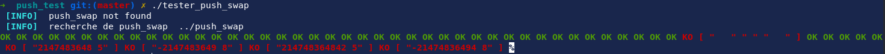
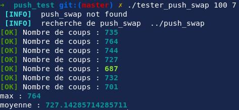
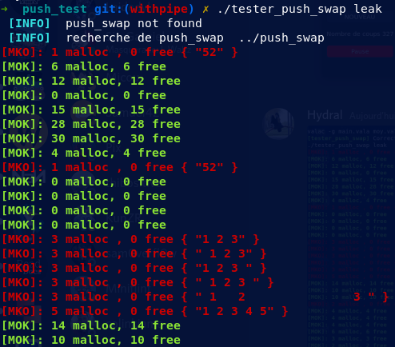

Testeur Push_swap en vala pour 42 Angouleme,

il permet de:
- Tester les cas d'erreures du push_swap.
- Faire une moyenne globale du nombres de vos coups.
- Verifier vos leaks de mémoire sur votre programme.

Vous pouvez aussi installer le visualizer de Stack A et B en 2D en bas de page.

# Installation

### 1. Download the repo
```bash
git clone https://gitlab.com/hydrasho/push_swap-testeur-max.git 
```

### 2. got to the repo cloned and compile the program

```bash
make all
```

# Utilisation

### MODE erreur de parse

`
 ./tester_push_swap [ nb_element ] [ nb_iteration ]
 `

 ./tester_push_swap true 			pour voir uniquement les erreures renvoyant une bonne valeur
 ./tester_push_swap false			pour voir uniquement les erreures renvoyant une mauvaise valeur.


### MODE Moyenne/Maximum de coups



**options**\
&nbsp; ***nb_element***  &nbsp;&nbsp;&nbsp;&nbsp; The number of element to sort\
&nbsp; ***nb_iteration*** &nbsp;&nbsp;&nbsp; The number of times you want to test your push_swap (default 10)\
&nbsp;&nbsp;&nbsp;  ***< none >*** &nbsp;&nbsp;&nbsp;&nbsp;&nbsp;&nbsp;&nbsp;&nbsp; Testing all error cases

### MODE leak

`./tester_push_swap leak` ou `./tester_push_swap valgrind`



# Note

Your program `push_swap` or `../push_swap` must be in the repo when lauching.\
Same for `checker_linux` (otherwise the checker will be downloaded).

I have also done a push_swap visualizer here ( [Have a look 😜](https://gitlab.com/hydrasho/visualizer-push-swap) )
